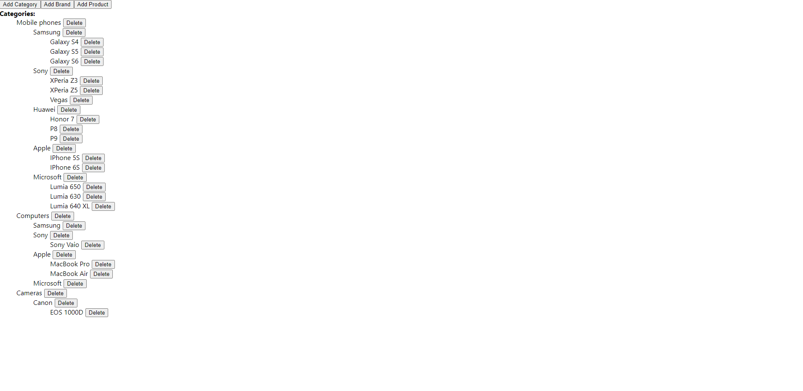

# Tech assignment

This application allows user to manipulate(Add/Delete) data in the UI which is imported from a json file.

# Technologies Used:

    * React Js

# Implementation :
Project is divided into components with the following hierarchy: 

    * App.js
        * CategoryList.jsx - initial data form json is imported, mapped and passed down to children, most functions executed in this component
            * Category.jsx
                * BrandList.jsx
                    * Brand.jsx
                        * ProductList.jsx
                            * Product.jsx

Functionality:

    * Delete Categories, Brands, Products
    * Add Categories, Brands and Products

Project has very minimal styling, as the focus was on funcionality. 

# How to run the project?

Download the repository, open in the editor and in terminal enter

    - npm install
    
 to install all the necessery node modules

After that enter 

    - npm start

to run the application